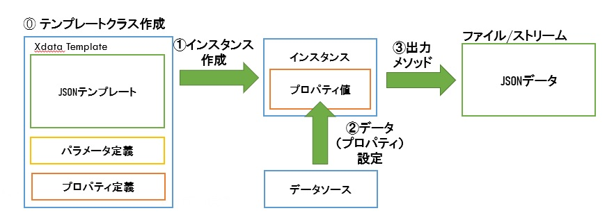

# 概要
JSONテンプレートエンジン。
テンプレートクラスに記載されたテンプレートを元にプロパティやパラメータ値を追加し、JSONデータを出力します。

また、FHIRドキュメントの出力に必要なテンプレートや作成支援機能も追加しています。

## テンプレートクラス

JSONテンプレートエンジンを使用するにはJSONTemplate.Baseクラスを継承し、XData Templateにテンプレートの内容を記述します。
テンプレート部分は以下のように記述します。

    XData Template [ MimeType = application/json ]
    {
      {
        "use": "official",
        "text": "#(..LastName)# #(..FirstName)#",
        "family": "#(..LastName)#" "given": [
          "#(..FirstName)#"
        ]
      }
    }
ここで、#(..LastName)#、#(..FirstName)#はそれぞれLastName,FirstNameプロパティ値を代入します。

次に、値を挿入するプロパティを定義します。

    Property LastName as %String;
    
    Property FirstName as %String;

## 使用方法

1. 作成したクラスのインスタンスを作成
    set obj=##class(テンプレートクラス名).%New()

    以下のように%New()のパラメータに%DynamicObjectを設定することで、各プロパティに値を代入することも可能です。
    この場合、プロパティに存在しないキーを指定すると、その内容は無視されます。

    set obj=##class(テンプレートクラス名).%New({"code":"A001","display":"テストコード"})

1. プロパティに値を設定
    プロパティには指定されたクラスのインスタンスだけでなく%DynamicObjectも使用できますので、
    set obj.Property={"param1":"xxxx","param2": "yyy"}
    といった記述も可能です。

1. 出力メソッド(OutputToDevice、OutputToFile、OutputToDevice、OutputToDynamicObjectメソッド)を実行

# プロパティ値の記述ルール
テンプレートデータの値部分には以下の記述ができます。

## \#(..プロパティ名)\#
プロパティ値を挿入します。
プロパティの型がテンプレートクラスの場合、そのクラスのテンプレートを元にしたJSONデータを出力します。
プロパティがlist形式の場合、JSON配列となり、その要素にプロパティ値が挿入されます。

## \#($this)\#
現在のインスタンスで指定されているテンプレートを元にしたJSONデータを出力します

## \#(..プロパティ名(クラス名))\#
プロパティの型がテンプレートクラスの場合、クラス名で指定したテンプレートを使用し、
JSONデータを出力します。

## \#(..#パラメータ名)\#
パラメータ値を挿入します。

## プロパティの型による出力の違い

    "key": "#(..value)#"
と記述した場合、プロパティvalueの型によって以下のように出力されます。

### プロパティの型が文字型の場合

    Property value as %Sring;

プロパティ値がそのままクオート文字に囲まれて出力されます。

    "key": "文字列"

### プロパティの型が数字型(%Numeric,%Integerなど)の場合

    Property value as %Numeric;

クオート文字が省略されて出力されます。

    "key": 123.45

### プロパティの型がテンプレートクラスの場合

    Property value as FHIRTemplate.Patient;

テンプレートクラスの内容が出力されます。

    "key": {
        "resourceType": "Patient",
        "meta": {
            "profile": [ ... ]
        },
        "identifier": {
            "system": "urn:oid: ...
            :
    }

## 値の一部にプロパティ値を指定する場合
JSONデータの値の一部をプロパティ値に変換することも可能です。
ただし、プロパティの型は文字列または数値である必要があります。
例1:

    {
        "fullUrl": "urn:uuid:**#(..ResourceId)#**"
    }

ResourceIdに"**xxxxxx-xxxx-xx**"が代入されている場合、以下のように変換されます

    {
        "fullUrl": "urn:uuid:xxxxxx-xxxx-xx"
    }

例2:

    {
        "text": "#(..LastName)# #(..FirstName)#"
    }

以下のように変換されます

    {
        "text": "鈴木 喜朗"
    }

## Arrayにプロパティ値を指定する場合
テンプレートのArray([]で括られた部分)には、プロパティを列挙することが可能です。
例：
以下のようなテンプレートクラスのプロパティObj1,Obj2があったとします。
    Property Obj1 as SubClass;
    Property Obj2 as SubClass;

このような場合、テンプレートクラスに以下のように記述しますと、

    "list": [ "#(..Obj1)#","#(..Obj2)#" ]

以下のように出力されます。

    "list": [
        {
            "name": "object1",
            "data": "obj1data"
        },{
            "name": "object2",
            "data": "obj2data"
        }
    ]

## Arrayにリストコレクションのプロパティを指定する場合
テンプレートのArray([]で括られた部分)に、リストコレクションのプロパティを指定すると、リストの順にArrayとして出力されます。
例：
以下のようなリストコレクションのプロパティがあったとします。

    Property objectlist as list of SubClass;

テンプレートに以下のように記述します。

    "list": [ "#(..objectlist)#" ]

以下のように出力されます。

    "list": [
        {
            "name": "item1",
            "data": "data1"
        },{
            "name": "item2",
            "data": "data2"
        }
    ]

## プロパティの型とは別のテンプレートクラスを指定した場合
テンプレートにて以下のように、指定したプロパティとは別のテンプレートクラスを指定することで、プロパティに指定されているインスタンスのデータを元に指定したテンプレートクラスを使ってJSONデータを出力できます。

例：
Compositionリソースのテンプレートにてsubjectの値としてpatientプロパティ(データタイプはFHIRTemplate.Patinet)を指定し、テンプレートクラスとしてFHIRTemplate.Referenceを指定します。

      :
    "subject": "#(..patient(FHIRTemplate.Reference))#",
      :

こうすることでpatientインスタンスにあるResourceIdとresourceTypeのみが出力され、Patientリソースへの参照に必要な項目のみが出力されます。

      :
    {
    "reference": "urn:uuid:xxxxxx-xxxx-xx",
    "type": "Patient"
    }
      :

# テンプレート実行時の作業
テンプレートからJSONデータを出力するまでの手順は以下の通りです。

1. 出力したいテンプレートクラスのインスタンスを作成します。

    set obj=##class(FHIRTemplate.Patient).%New()

2. プロパティを設定します

    set obj.LastName="鈴木",obj.FirstName="喜朗"

3. JSONデータ出力メソッドを実行します。

    set ret=obj.OutputToFile("c:\temp\patient.json")

## プロパティの指定方法
プロパティの指定方法は以下の通りです。

1. 文字列や数値を指定する

    set obj.Property="文字列"

2. 別クラスのインスタンスを指定

    set sub=##class(SubClass).%New()
    set sub.name="xxxxx",sub.data="yyyyy"
    set obj.Property=sub

3. %DynamicObjectを使用して別クラスのインスタンスを指定
    
    set obj.Property={"name":"xxxxx","data":"yyyyy"}
    
1. %Net()のパラメータとしてにプロパティの情報をDynamicObjet形式で指定する

    set obj.Property=##class(SubClass).%New(
        {"name":"xxxxx","data":"yyyyy"})

## リストコレクションのプロパティの指定方法
リストコレクションの場合、Insertメソッドでデータやインスタンスを指定

1. 文字列や数値を指定

   do obj.PropertyInsert("文字列")

2. 別クラスのインスタンスを指定

    set sub=##class(SubClass).%New()
    set sub.name="xxxxx",sub.data="yyyyy"
    do obj.Property.Insert(sub)

# JSON出力機能
インスタンスメソッドとして以下のメソッドがあります。

1. **OutputToDevice()**
標準デバイスにJSONデータを出力します

1. **OutputToFile(ファイル名)**
指定されたファイルに出力します。

1. **OutputToStream(ストリーム名)**
指定されたファイルに出力します。

1. **OutputToDynamicObject(.変数)**
参照渡しで指定された変数にダイナミックオブジェクトを設定します。

# ObjectScriptライブラリを利用した機能

## CodeTable参照機能

%Persistent,FHIRTemplate.UtilCodeTable,FHIRTemplate.CodeableConceptBase

または

%Persistent,FHIRTemplate.UtilCodeTable,FHIRTemplate.CodingBase

のそれぞれ３つのクラスを継承することで、GetByCode()メソッドのパラメータとして指定されたコードからそれに対応する表示値を取得し、CodeableConceptの形式でJSONデータを出力します。

### システムURIの設定

コード体系を表すシステムURIはCodeSystemパラメータに設定します。

例：

    Parameter CodeSystem = "http://jpfhir.jp/fhir/Common/CodeSystem/admit-Source";
　

    Parameter CodeSystem = "urn:oid:1.2.392.200119.4.101.6";

### Idkey属性インデックスの設定

コードをキーとして値を検索するため、以下のようにIdkey属性のインデックスを設定する必要があります。

    Index IDKeyIdx On code [ IdKey, Unique ];

### 登録データの設定

登録するデータは以下の例ようにXData InsertCode内のdataプロパティのArrayにコードと表示値をセミコロン(;)で連結させた文字列を設定します。

    XData InsertCode [ MimeType = application/json ]
    {
      { "data":[
        "0;院内の他病棟からの転棟",
        "1;家庭からの入院",
        "4;他の病院・診療所の病棟からの転院",
        "5;介護施設・福祉施設に入所中",
        "8;院内で出生",
        "9;その他"
      ]  
      }
    }

設定例についてはFHIRCustom.CodeableConceptパッケージにある各クラスをご参照ください。

### 登録データのロード方法

登録データは事前にテーブルに登録する必要があります。登録にはGenerateData()メソッドを使用します。

    set ret=##class(クラス名).GenerateData()

### 登録データの一括ロード

CodeTableクラスを継承している全てのクラスで登録データをロードするにはGenerateAllメソッドを使用します。

    set ret=##class(FHIRTemplate.Util.CodeTable).GenerateAll()

### テンプレートへの指定方法

作成したテンプレートクラスをEncounterなど別のテンプレートに出力するには出力したい個所に%String型のプロパティを指定し、そのプロパティに作成したテンプレートクラスを指定します。

例：

テンプレートでの指定

ここでは以下のように%String型のadmitSourceプロパティにFHIRCustom.CodeableConcept.AdmitSourceのテンプレートクラスを指定します

    "admitSource": "#(..admitSource(FHIRCustom.CodeableConcept.AdmitSource))#"

テンプレートクラスのプロパティ定義

admitSourceは%String型とします。

    Property admitSource as %String;

プロパティの設定　

テンプレートのインスタンスobjのプロパティにFHIRCustom.CodeableCondept.AdmitSourceクラスのコードを指定します。

    set obj.admitSource = 1

出力結果

JSONデータ出力時にadmitSourceプロパティで指定されたコード(=1)を元にGetByCode()メソッドを呼出し、システムURIや表示値を取得し、CodeableConcept形式で出力します。

    "admitSource": {
      "coding": [{
        "system":"http://jpfhir.jp/fhir/Common/CodeSystem/admit-Source",
        "code":"1",
        "display":"家庭からの入院"
      }]
    }

## FHIR ドキュメント生成機能

BundleテンプレートクラスのCreateFHIRDocumentメソッドを実行することで、パラメータに指定されたCompositionインスタンスに紐づいた各リソースのインスタンスを取得し、entryプロパティに登録されたBundleインスタンスを作成します。
実行メソッドは以下の通りです。

    set bundle=##class(FHIRTemplate.Bundle).CreateFHIRDocument(composition)

または

    set bundle=##class(FHIRTemplate.Bundle).CreateFHIRDocument(composition,attester)

attesterは文書法的責任者を記載したPractitionerテンプレートクラスのインスタンス

## OnPreProcessメソッド

テンプレートクラスで、JSONデータ出力前に実行する処理を記述することができます。JSONデータを出力するのに必要なプロパティ値を設定したり、他のプロパティから値を生成させることができます。 
例： 
FHIRTemplate.DataType.Addressクラスにて、OnPreProcessメソッドを以下のように記述することで、textプロパティがNULLでstateならびにcityプロパティに値が入っているとき、textプロパティにstate,city,lineプロパティの値を連結して代入することで、住所がtextプロパティに設定されるようにしています。

    ClassMethod OnPreProcess(obj As FHIRTemplate.Resource) As %Status
    {
      if obj.text=""&&((obj.state'="")||(obj.city'="")) {
        set obj.text=obj.state_obj.city_obj.line
      }
      quit $$$OK
    }

# 実行手順

1. クラスをロードします。 
適当なネームスペースを用意し、リポジトリのクラスを全てロードします。

2. 病名交換用コードの読み込み 
MEDIS標準病名マスター病名交換用コード nmain5xx.txt をダウンロードし、以下のコマンドでFHIRCustom.DB.ByomeiCodeクラスにロードします。

    `do ##class(FHIRCustom.DB.ByomeiCode).ImportData("c:\temp\nmain5xx.txt")`

3. 修飾語交換用コードの読み込み 
MEDIS標準病名マスター修飾語交換用コード mdfy5xx.txt をダウンロードし、以下のコマンドでFHIRCustom.DB.ModifierCodeクラスにロードします。

    `do ##class(FHIRCustom.DB.ModifierCode).ImportData("c:\temp\mdfy5xx.txt")`

4. 登録データの一括ロード 
FHIRTemplate.Util.CodeTableクラスを継承したクラスについて、以下のメソッドを実行し、必要なデータをロードします。

    `do ##class(FHIRTemplate.Util.CodeTable).GenerateAll()`

5. FHIRドキュメント出力サンプルを実行 
以下のメソッドを実行し、FHIRドキュメント(c:\temp\bundle-test.json)を作成します。

    `do ##class(FHIRTest.BundleTest).Test1()`

# 収録クラス

## JSONTemplate.Base
テンプレートの基底クラス

## JSONTEmplate.Generator
テンプレート出力メソッドの生成クラス

## FHIRTemplate.ResourceBase
FHIRTemplate基底クラス

## FHIRTemplate.Resource
FHIRリソース基底クラス

## FHIRTemplate.Bundle
Bundleリソース出力クラス

## FHIRTemplate.＊
各種リソース出力クラス

## FHIRTemplate.DataType.＊
各種データタイプ出力クラス

## FHIRCustom.CodeableConcept.＊
CodeableConcept型のコードテーブルクラス

## FHIRCustom.Coding.＊
Coding型のコードテーブルクラス

## FHIRTest.＊
テンプレート出力テストクラス

