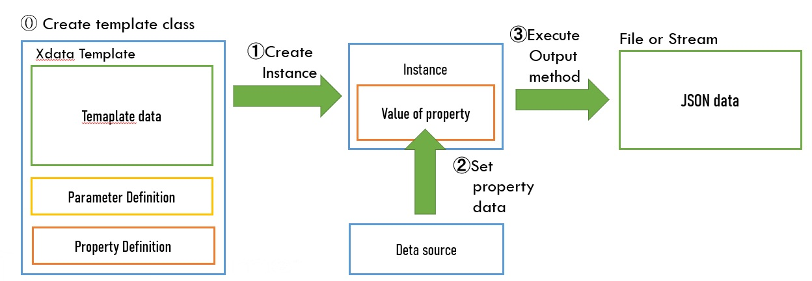

# JSON Template Engine (ObjectScript) + FHIR Template Library

A JSON template engine for InterSystems IRIS / ObjectScript.

This library generates JSON output based on templates defined in template classes.  
You can insert values from class properties or runtime parameters into the template and export JSON data.

It also includes additional templates and helper features for generating **FHIR documents**.



---

## Features

- Define JSON templates in ObjectScript classes (`XData Template`)
- Replace placeholders with:
  - Class property values
  - Runtime parameters
- Supports nested templates (template classes inside template classes)
- Supports lists (JSON array output)
- Output JSON to:
  - Device (stdout)
  - File
  - Stream
  - `%DynamicObject`
- Includes:
  - Code table lookup utilities (FHIR CodeableConcept/Coding generation)
  - FHIR document generator (`Bundle.CreateFHIRDocument()`)

---

## Quick Start

1. Clone this repository and open it in VS Code (ObjectScript extension) or Studio.
2. Import/compile the classes under `src/` into a target namespace.
3. (FHIR templates only) Load the code tables and helper data, then run the sample:

```objectscript
// Optional (FHIR template sample): load MEDIS master data if you use the provided JP examples
do ##class(FHIRCustom.DB.ByomeiCode).ImportData("c:\\temp\\nmain5xx.txt")
do ##class(FHIRCustom.DB.ModifierCode).ImportData("c:\\temp\\mdfy5xx.txt")

// Load all built-in code tables (CodeableConcept/Coding helpers)
do ##class(FHIRTemplate.Util.CodeTable).GenerateAll()

// Generate a sample FHIR document Bundle (outputs c:\temp\bundle-test.json)
do ##class(FHIRTest.BundleTest).Test1()
```

4. Use the generated JSON file as a reference for your own templates or for validation against a FHIR server.

---

## Template Class Definition

To use the JSON template engine:

1. Create a class that extends `JSONTemplate.Base`
2. Write the JSON template inside `XData Template`

Example:

```objectscript
XData Template [ MimeType = application/json ]
{
  {
    "use": "official",
    "text": "#(..LastName)# #(..FirstName)#",
    "family": "#(..LastName)#",
    "given": [
        "#(..FirstName)#"
    ]
  }
}
```

`#(..LastName)#` and `#(..FirstName)#` are placeholders replaced by the values of properties `LastName` and `FirstName`.

Define properties:

```objectscript
Property LastName as %String;
Property FirstName as %String;
```

---

## Basic Usage

### 1) Create an instance

```objectscript
set obj = ##class(YourTemplateClass).%New()
```

You can also pass a `%DynamicObject` to `%New()` to initialize properties:

```objectscript
set obj = ##class(YourTemplateClass).%New({"code":"A001","display":"テストコード"})
```

> Keys not defined as properties will be ignored.

---

### 2) Set property values

Properties can be set with normal values, class instances, or `%DynamicObject`.

Example using `%DynamicObject`:

```objectscript
set obj.Property = {"param1":"xxxx","param2":"yyy"}
```

---

### 3) Output JSON

Run one of the output methods:

- `OutputToDevice()`
- `OutputToFile(filename)`
- `OutputToStream(stream)`
- `OutputToDynamicObject(.var)`

Example:

```objectscript
do obj.OutputToDevice()
```

---

## Placeholder Syntax Rules

You can use the following placeholder formats in JSON values.

### `#(..PropertyName)#`

Insert the value of the property.

- If the property type is a template class → outputs nested JSON based on that class template
- If the property is a list → outputs a JSON array

---

### `#($this)#`

Outputs JSON generated from the current instance’s own template.

---

### `#(..PropertyName(ClassName))#`

If the property type is a template class, you can explicitly specify another template class name to generate JSON output.

---

### `#(..#ParamName)#`

Insert a runtime parameter value.

---

## Output Differences by Property Type

If the template contains:

```json
"key": "#(..value)#"
```

the output format depends on the type of `value`.

### String type

```objectscript
Property value as %String;
```

Output is quoted:

```json
"key": "text"
```

### Numeric type (`%Numeric`, `%Integer`, etc.)

```objectscript
Property value as %Numeric;
```

Output has no quotes:

```json
"key": 123.45
```

### Template class type

```objectscript
Property value as FHIRTemplate.Patient;
```

Outputs nested JSON from that template class:

```json
"key": {
  "resourceType": "Patient",
  "meta": { ... }
}
```

---

## Partial Replacement in Strings

You can embed placeholders inside a string.

**Requirement:** property type must be String or Numeric.

Example:

```json
{
  "fullUrl": "urn:uuid:#(..ResourceId)#"
}
```

If `ResourceId = "xxxxxx-xxxx-xx"` then output becomes:

```json
{
  "fullUrl": "urn:uuid:xxxxxx-xxxx-xx"
}
```

Example:

```json
{
  "text": "#(..LastName)# #(..FirstName)#"
}
```

Output:

```json
{
  "text": "鈴木 喜朗"
}
```

---

## Arrays and Lists

### 1) Enumerating multiple object properties

If your class has:

```objectscript
Property Obj1 as SubClass;
Property Obj2 as SubClass;
```

Template:

```json
"list": [ "#(..Obj1)#", "#(..Obj2)#" ]
```

Output becomes an array with both objects.

```json
    "list": [
        {
            "name": "object1",
            "data": "obj1data"
        },{
            "name": "object2",
            "data": "obj2data"
        }
    ]
```
---

### 2) Output list collection as an array

If your class has a list collection:

```objectscript
Property objectlist as list of SubClass;
```

Template:

```json
"list": [ "#(..objectlist)#" ]
```

It will output all list items as a JSON array.

```json
    "list": [
        {
            "name": "item1",
            "data": "data1"
        },{
            "name": "item2",
            "data": "data2"
        }
    ]
```
---

## Using a Different Template Class for a Property

Even if the property is a template class instance, you can output it using another template.

Example: In a Composition template, output `patient` as `FHIRTemplate.Reference`:

```json
"subject": "#(..patient(FHIRTemplate.Reference))#"
```

This is useful when you want only the reference fields (`reference`, `type`) instead of full Patient content.

```json
      :
    {
    "reference": "urn:uuid:xxxxxx-xxxx-xx",
    "type": "Patient"
    }
      :
```

---

## Template Execution Flow

Typical procedure:

1. Create a template instance

```objectscript
set obj = ##class(FHIRTemplate.Patient).%New()
```

2. Set properties

```objectscript
set obj.LastName="鈴木", obj.FirstName="喜朗"
```

3. Output JSON

```objectscript
set ret = obj.OutputToFile("c:\temp\patient.json")
```

---

## Property Assignment Patterns

### 1) Assign primitive values

```objectscript
set obj.Property="text"
```

### 2) Assign another class instance

```objectscript
set sub = ##class(SubClass).%New()
set sub.name="xxxxx", sub.data="yyyyy"
set obj.Property=sub
```

### 3) Assign `%DynamicObject`

```objectscript
set obj.Property={"name":"xxxxx","data":"yyyyy"}
```

### 4) Initialize a nested object using `%New()` with `%DynamicObject`

```objectscript
set obj.Property = ##class(SubClass).%New({"name":"xxxxx","data":"yyyyy"})
```

---

## List Collection Assignment

To add items to a list collection, use `Insert()`.

### Insert primitive values

```objectscript
do obj.Property.Insert("text")
```

### Insert object instances

```objectscript
set sub=##class(SubClass).%New()
set sub.name="xxxxx", sub.data="yyyyy"
do obj.Property.Insert(sub)
```

---

## JSON Output Methods

This engine provides the following instance methods:

- **`OutputToDevice()`**  
  Outputs JSON to the standard device

- **`OutputToFile(filename)`**  
  Writes JSON into a file

- **`OutputToStream(stream)`**  
  Writes JSON to a stream

- **`OutputToDynamicObject(.var)`**  
  Returns output as `%DynamicObject` via pass-by-reference

---

## Features Using ObjectScript Library Classes

### Code Table Lookup (FHIR CodeableConcept / Coding)

By inheriting:

- `%Persistent`
- `FHIRTemplate.UtilCodeTable`
- `FHIRTemplate.CodeableConceptBase`

or:

- `%Persistent`
- `FHIRTemplate.UtilCodeTable`
- `FHIRTemplate.CodingBase`

you can implement a `GetByCode()` method that converts a given code into a FHIR JSON structure.

#### Configure Code System URI

Set the system URI by defining `Parameter CodeSystem`.

Example:

```objectscript
Parameter CodeSystem = "http://jpfhir.jp/fhir/Common/CodeSystem/admit-Source";
```

or:

```objectscript
Parameter CodeSystem = "urn:oid:1.2.392.200119.4.101.6";
```

#### Required Index

To search by code, define an IdKey index:

```objectscript
Index IDKeyIdx On code [ IdKey, Unique ];
```

#### Define Initial Data (`XData InsertCode`)

To register data, set the `data` array in `XData InsertCode` to strings that combine the code and display text with a semicolon (`;`), as in the example below.
For more examples, see the classes in `FHIRCustom.CodeableConcept`.

```objectscript
XData InsertCode [ MimeType = application/json ]
{
  { "data":[
    "0;院内の他病棟からの転棟",
    "1;家庭からの入院",
    "4;他の病院・診療所の病棟からの転院"
  ]}
}
```

#### Load Code Table Data

Load data into the table using:

```objectscript
set ret = ##class(YourClassName).GenerateData()
```

To load all code table classes at once:

```objectscript
set ret = ##class(FHIRTemplate.Util.CodeTable).GenerateAll()
```

#### Using Code Tables in a Template

In template JSON:

```json
"admitSource": "#(..admitSource(FHIRCustom.CodeableConcept.AdmitSource))#"
```

Property type should be `%String`:

```objectscript
Property admitSource as %String;
```

Set the code:

```objectscript
set obj.admitSource = 1
```

When outputting JSON, the code (=1) specified in `admitSource` is used to call `GetByCode()`, which retrieves the system URI and display text and outputs a CodeableConcept structure.

Output example:

```json
"admitSource": {
  "coding": [{
    "system":"http://jpfhir.jp/fhir/Common/CodeSystem/admit-Source",
    "code":"1",
    "display":"家庭からの入院"
  }]
}
```

---

## FHIR Document Generation (Bundle)

The repository includes a FHIR template library, and provides a convenience method to build a **FHIR Document Bundle** from a `Composition` instance:

```objectscript
set bundle = ##class(FHIRTemplate.Bundle).CreateFHIRDocument(composition)
```

### What `CreateFHIRDocument()` does

- Collects the resources that belong to the given **Composition** (and its referenced/related resources, depending on how the templates are linked).
- Creates a `Bundle` instance and populates `entry` with the document resources.
- Returns the `FHIRTemplate.Bundle` instance so you can export it using `OutputToFile`, `OutputToStream`, etc.

### With an attester (legal responsible person)

You can optionally pass an `attester` (`FHIRTemplate.Practitioner`) that represents the legally responsible person for the document:

```objectscript
set bundle = ##class(FHIRTemplate.Bundle).CreateFHIRDocument(composition, attester)
```

### Typical usage pattern

1. Build (or load) the `Composition` and the resources it references (e.g., Patient, Encounter, Practitioner, Observations, …).
2. Make sure the `Composition` is linked to those resources using the expected reference properties in your templates.
3. Call `CreateFHIRDocument()` and output the resulting Bundle as JSON.

Example:

```objectscript
// composition: an instance of a template class that represents a FHIR Composition
// (set the necessary properties / references first)
set bundle = ##class(FHIRTemplate.Bundle).CreateFHIRDocument(composition)
do bundle.OutputToFile("c:\\temp\\my-document-bundle.json")
```

### Sample included in this repository

The repository includes a runnable sample that generates a document bundle JSON:

```objectscript
do ##class(FHIRTest.BundleTest).Test1()
```

Output:

- `c:\temp\bundle-test.json`

## `OnPreProcess` Hook

Template classes can implement `OnPreProcess()` to run preprocessing logic before JSON output.

Example: In `FHIRTemplate.DataType.Address`, `text` can be generated automatically from fields:

```objectscript
ClassMethod OnPreProcess(obj As FHIRTemplate.Resource) As %Status
{
  if obj.text=""&&((obj.state'="")||(obj.city'="")) {
    set obj.text=obj.state_obj.city_obj.line
  }
  quit $$$OK
}
```

---

## Setup / Installation Steps

1. Prepare a namespace and load all classes from this repository.

2. Load disease name conversion codes  
   Download `nmain5xx.txt` and import into `FHIRCustom.DB.ByomeiCode`:

```objectscript
do ##class(FHIRCustom.DB.ByomeiCode).ImportData("c:\temp\nmain5xx.txt")
```

3. Load modifier conversion codes  
   Download `mdfy5xx.txt` and import into `FHIRCustom.DB.ModifierCode`:

```objectscript
do ##class(FHIRCustom.DB.ModifierCode).ImportData("c:\temp\mdfy5xx.txt")
```

4. Load all registered code table data:

```objectscript
do ##class(FHIRTemplate.Util.CodeTable).GenerateAll()
```

5. Run the sample FHIR document export:

```objectscript
do ##class(FHIRTest.BundleTest).Test1()
```

This will generate:

- `c:\temp\bundle-test.json`

---

## Included Classes

### JSON Template Engine

- `JSONTemplate.Base`  
  Base class for template classes

- `JSONTemplate.Generator`  
  Generator for template output methods

### FHIR Template Framework

- `FHIRTemplate.ResourceBase`  
  Base class for FHIR templates

- `FHIRTemplate.Resource`  
  Base class for FHIR resources

- `FHIRTemplate.Bundle`  
  Bundle output class

- `FHIRTemplate.*`  
  Resource templates

- `FHIRTemplate.DataType.*`  
  Data type templates

### Custom Code Tables

- `FHIRCustom.CodeableConcept.*`  
  CodeableConcept code table templates

- `FHIRCustom.Coding.*`  
  Coding code table templates

### Tests / Samples

- `FHIRTest.*`  
  Template output test classes

---
