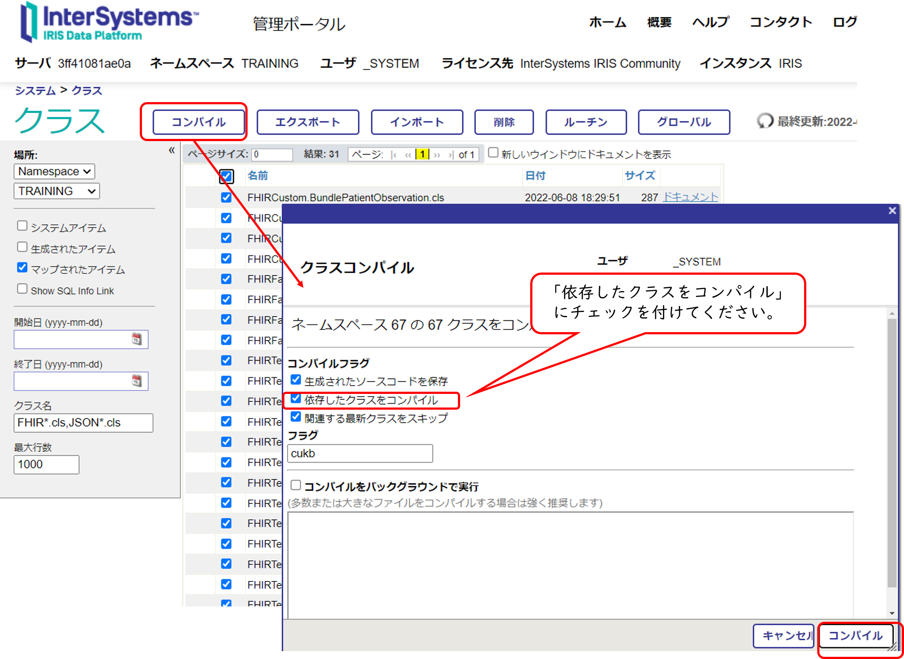

# FHIRファサードをIRISで作ってみよう！

このフォルダに含まれるサンプルを利用して、データベースにあるデータからFHIRリソースを作成する流れを簡単に確認することができます。

サンプルでは、以下の情報をデータベースに登録します。

- 患者基本情報（ISJHospital.Patient）
- 患者に紐づく身長・体重の測定値（ISJHospital.Observation）

サンプルでは、RESTサーバ（RESTディスパッチクラス）を用意していて、エンドポイント（/facade）に **/Patient/患者番号** を指定したGET要求を行うと、ISJHospital.Patientテーブルを検索し、取得できた情報からFHIRのPatientリソースを作成し、返送します。

また、エンドポイント（/facade）に **/Patient/患者番号/everything**　を指定したGET要求を行うと、ISJHospita.PatientテーブルからPatientリソースを作成し、患者に紐づく身長・体重測定データからObservationリソースを作成し、Bundleリソースに詰め合わせた結果を返送します。


## 利用前の準備

IRIS for Healthのインストールで用意されるFHIR R4リソースリポジトリ用のプロファイルの更新を行ってください。

方法は、[PDF](../../FHIRR4CurrentProfileUpdate.pdf) をご参照ください。

## 使用方法
**JSONテンプレートエンジン** がIRISにインポートされている状態でお試しください。

[src](../../src)フォルダ以下のクラス定義をインポートします。

コンパイルは後で行いたいので、[src](../../src) を右クリックし、[**Import Without Compililation**] を行ってください。


- 1) 患者基本情報、患者に紐づく身長・体重の測定値のデータインポート

    IRISの **管理ポータル > システムエクスプローラ > SQLメニュー** を開き、任意のネームスペースに移動します。
    クエリ実行タブで[Table.sql](./ISJHospital/Table.sql) にあるSQL文を1文ずつ実行してください。

    以下のLOAD DATA FROM FILE以降に指定しているファイル：[InputDataPatient.csv](./ISJHospital/InputDataPatient.csv) は、フルパスで指定する必要があります。
    実行環境に合わせ変更後ご利用ください。（[InputDataLabTest.csv](./ISJHospital/InputDataLabTest.csv)のLOAD DATAについても同様にご変更ください。）
    ```
    LOAD DATA FROM FILE '/home/irisowner/InputDataPatient.csv'
    INTO ISJHospital.Patient
    USING {"from":{"file":{"charset":"UTF-8"}}}
    ```

- 2) コンパイル

    管理ポータル、または、ターミナルから実行してください。

    - a) 管理ポータルでのコンパイル

        管理ポータルを開き、システムエクスプローラ > クラス を開き、接続先のネームスペースを指定します。

        画面左のクラス名のテキストボックスに **FHIR*.cls,JSON*.cls** を指定しEnterをクリックします。

        表示されるクラス（FHIRから始まる名前のクラスとJSONから始まる名前のクラス全部）を全選択し、コンパイルボタンをクリックします。

        「コンパイルフラグ」から **「依存したクラスをコンパイル」** にチェックを入れ、コンパイルをクリックします。

        依存関係の影響でエラーが出るので、「完了」ボタンをクリックし、**もう1度「コンパイル」ボタンからコンパイルを実施します。**
        
        コンパイルが正常終了したら、画面を閉じます。

        図解も参照ください。
        


    - b) ターミナルで実行する場合

        IRISにログインし、対象ネームスペースに移動します。
        
        Windowsの場合は、IRのランチャーからターミナルを選択します。

        windows以外の場合は、OSにログイン後、以下コマンドでログインします。
        （session の右側の引数は構成名を指定します。）
        ```
        iris session iris
        ```

        対象ネームスペースに移動します（例はTRAININGネームスペースへ移動）

        ```
        set $namespace="TRAINING"
        ```

        コンパイルを実施します。
        ```
        do $system.OBJ.CompilePackage("JSONTemplate,FHIRTemplate,FHIRCustom,FHIRTest,FHIRFacade","cukb")
        ```
        依存関係のエラーが出るため、もう1度同じコマンドを実行します。
        ```
        do $system.OBJ.CompilePackage("JSONTemplate,FHIRTemplate,FHIRCustom,FHIRTest,FHIRFacade","cukb")
        ```

- 3) MEDISの看護実践用語標準マスターのインポート
    [FHIRCustom.DB.BodyMeasurementCode](./FHIRCustom/DB/BodyMeasurementCode.cls)にデータをインポートします。

    インポートデータは、MEDISが公開している以下ページよりダウンロードください。

    https://www2.medis.or.jp/master/kango/index.html
    https://www2.medis.or.jp/master/kango/kansatsu/kansatsu-ver.3.6.txt

    ダウンロード後、IRISにログインし、クラス定義をインポートしたネームスペースに移動した後、以下実行します。

    以下の例は、TESTネームスペースにソースコードをインポートした状態で試しています。
    また、ダウンロードしたファイルを　/home/irisowner/　以下に配置した状態で試しています。
    （ファイル名はフルパスで指定してください。）
    ```
    set $namespace="TEST
    write ##class(FHIRCustom.DB.BodyMeasurementCode).ImportData("/home/irisowner/kansatsu-ver3.6.txt")
    ```

    データがインポートできたかどうかは、SQLで確認できます。
    ```
    SELECT * FROM FHIRCustom_DB.BodyMeasurementCode
    ```

- 4) エンドポイントの作成（/facade）

    管理ポータル > システム管理 > セキュリティ > アプリケーション > ウェブ・アプリケーション で「新しいウェブ・アプリケーションを作成」ボタンをクリックします。

    図のように設定してください。
    


- 5) RESTクライアントからGET要求実行！
    
    http://127.0.0.1:52773/facade/Patient/498374

    http://127.0.0.1:52773/facade/Patient/498374/everything

